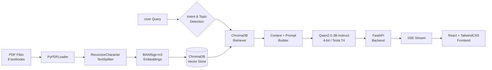

<div align="center">
  
  <h1 align="center">
    <a href="https://git.io/typing-svg"></a>
  </h1>
  <p align="center">
    <b>RAG-powered Indonesian-language chatbot</b> — combines a 4-bit quantized <b>Qwen2.5-3B-Instruct</b> LLM with a <b>ChromaDB</b> vector store and <b>FastAPI</b> backend, wrapped in a modern <b>React + TailwindCSS</b> frontend.
  </p>
  <p align="center">
    <a href="#-tech-stack">Tech Stack</a> •
    <a href="#-features">Features</a> •
    <a href="#-project-structure">Structure</a> •
    <a href="#-quick-start">Quick Start</a> •
    <a href="#-rouge-evaluation">ROUGE Eval</a>
  </p>
</div>

---

## Features

<table>
<tr>
<td>

- **Retrieval-Augmented Generation (RAG)** — answers grounded in 8 PDF textbooks (Java, Python, Git, MySQL, GenAI, Web Programming, etc.)
- **4-bit Quantized LLM** — Qwen2.5-3B-Instruct loaded with BitsAndBytes `nf4`, runs on a single Tesla T4 (Colab)
- **Streaming Responses** — SSE-powered real-time token streaming via FastAPI
- **Smart Intent Detection** — automatically classifies queries as coding error, coding help, general question, or general chat
- **Topic-Aware Retrieval** — `detect_topic()` maps keywords to specific PDFs, filters ChromaDB context accordingly

</td>
<td>

- **Persistent Vector Store** — ChromaDB backed by Google Drive + manifest system for incremental PDF updates
- **Cloudflare Tunnel** — exposes Colab-hosted backend to the internet without deployment
- **Modern UI** — React 19 + TailwindCSS v4 + GSAP animations + Three.js particle effects
- **Conversation Management** — create, rename, delete, export, import chat histories
- **Dark Mode** — premium dark theme with accent color customization
- **ROUGE Evaluation** — built-in 90-question benchmark across 8 PDF categories

</td>
</tr>
</table>

---

## Tech Stack

### Backend & AI

<p align="center">
  
  
  
  
  
  
</p>
<p align="center">
  
  
  
  
  
  
  
  
</p>

### Frontend

<p align="center">
  
  
  
  
  
  
  
</p>

---

## Project Structure

```
 chatbot/
├──  backend/
│   └── chatbot.ipynb              # Full pipeline: install → load PDFs → chunk → embed → ChromaDB → load LLM → FastAPI
│
├──  chatbot-ui/                  # React frontend
│   ├── src/
│   │   ├── components/             # UI components
│   │   │   ├── ChatArea.jsx        # Message list with markdown rendering
│   │   │   ├── ChatInput.jsx       # Input bar with send/stop
│   │   │   ├── Sidebar.jsx         # Conversation sidebar
│   │   │   ├── WelcomeScreen.jsx   # Landing page
│   │   │   ├── Presentation.jsx    # Intro animation
│   │   │   ├── GridScan.jsx        # Three.js scan-line effect
│   │   │   ├── SettingsModal.jsx   # Accent color + grid toggle
│   │   │   ├── MessageBubble.jsx   # Chat message display
│   │   │   ├── TypingIndicator.jsx # Loading animation
│   │   │   ├── CopyButton.jsx      # Copy code button
│   │   │   ├── Shuffle.jsx         # Decorative text shuffle
│   │   │   ├── BlurText.jsx        # Text blur animation
│   │   │   ├── SplitText.jsx       # Text split animation
│   │   │   └── ui/                 # shadcn/ui primitives
│   │   ├── hooks/
│   │   │   └── useLocalStorage.js  # Persistent localStorage hook
│   │   └── App.jsx                 # Main app with state management
│   ├── package.json
│   └── vite.config.js
│
├──  docs/                        # Documentation & specs
├──  .gitignore
└──  README.md
```

---

## Quick Start

### 1. Backend (Google Colab)

<a href="https://colab.research.google.com/drive/1-842e9EH3hmfSBHJSPaVHu_Cduuh_p9k" target="_blank">
  
</a>

| Step | Action |
|------|--------|
| 1 | Open the notebook in Colab |
| 2 | Run all cells — this installs dependencies, loads 8 PDFs, chunks & embeds them into ChromaDB, loads Qwen2.5-3B-Instruct (4-bit), and starts FastAPI on port **8010** |
| 3 | A Cloudflare Tunnel URL is generated automatically — copy the public URL |
| 4 | Set `VITE_API_URL` in `chatbot-ui/.env` to your tunnel URL |

> **Note:** The notebook requires a Hugging Face token (`HF`) stored as a Colab secret. GPU runtime (Tesla T4+) is strongly recommended.

### 2. Frontend

```bash
cd chatbot-ui
cp .env.example .env
# Set VITE_API_URL to your Colab tunnel URL

npm install
npm run dev
```

Open `http://localhost:5173` in your browser.

---

## ROUGE Evaluation

The system includes an automated 90-question benchmark across **8 PDF categories**:

| Category | Questions | ROUGE-1 | ROUGE-2 | ROUGE-L |
|----------|-----------|---------|---------|---------|
| Java (Dasar Pemrograman) | 10 | 0.073 | 0.022 | 0.062 |
| Coding Dasar | 10 | 0.097 | 0.050 | 0.085 |
| GenAI (Buku Panduan) | 10 | **0.149** | **0.081** | **0.139** |
| MySQL | 10 | 0.043 | 0.006 | 0.041 |
| Web Programming | 10 | 0.066 | 0.020 | 0.056 |
| Git (ProGit) | 10 | 0.036 | 0.008 | 0.034 |
| Python (PythonLearn) | 20 | 0.040 | 0.007 | 0.035 |
| Komputer FULL | 10 | 0.063 | 0.015 | 0.057 |
| **Overall** | **90** | **0.067** | **0.024** | **0.061** |

> Evaluation methodology: Each question's answer is compared against the ground-truth reference from the source PDF using the ROUGE metric.

---

## Architecture



---

## Configuration

| Variable | Description | Default |
|----------|-------------|---------|
| `VITE_API_URL` | FastAPI backend URL (Colab tunnel) | `http://localhost:8010` |
| `HF_TOKEN` | Hugging Face access token (Colab secret) | — |
| `EMBEDDING_MODEL` | Sentence embedding model | `BAAI/bge-m3` |
| `MODEL_NAME` | LLM model | `Qwen/Qwen2.5-3B-Instruct` |
| `CHROMA_DIR` | ChromaDB persistence path | `/content/chatbot-db/chroma_db` |
| `PDF_DIR` | PDF source directory | `/gdrive/MyDrive/chatbot-pdfs` |
| `chunk_size` | Document chunk size | 700 |
| `chunk_overlap` | Chunk overlap | 150 |
| `k` | Number of retrieved chunks | 15 |

---

## PDF Sources

| PDF | Topics |
|-----|--------|
| `03. DASAR-DASAR PEMROGRAMAN.pdf` | Java, tipe data, identifier, operator, komentar |
| `642863-dasar-dasar-coding-....pdf` | Coding, algoritma, percabangan, perulangan |
| `Buku-Panduan-GenAI-....pdf` | AI, GenAI, T.U.C.E. Framework, etika akademik |
| `MySQLNotesForProfessionals.pdf` | MySQL, JOIN, INDEX, foreign key |
| `Pemrograman Web Dasar.pdf` | HTML, CSS, JavaScript, PHP |
| `Pemrograman Komputer FULL.pdf` | Python, return, `__init__`, modul, file I/O |
| `progit.pdf` | Git, branching, rebase, stash, bisect |
| `pythonlearn.pdf` | Python fundamentals, strings, files, regex |

---

## License

This project is for educational and research purposes.

---

<div align="center">
  <sub>Built with using Google Colab · FastAPI · React · TailwindCSS</sub>
  <br/>
  <a href="https://colab.research.google.com/drive/1-842e9EH3hmfSBHJSPaVHu_Cduuh_p9k" target="_blank">
    
  </a>
</div>
